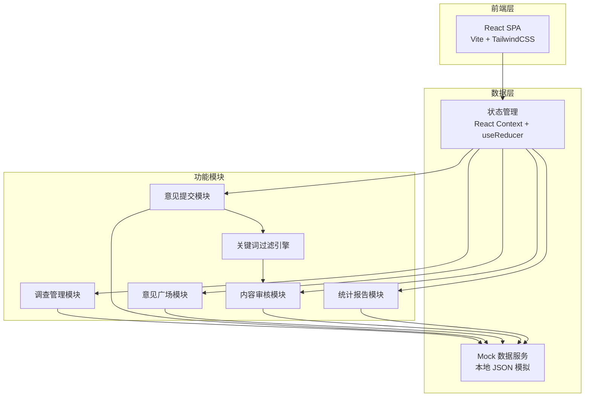
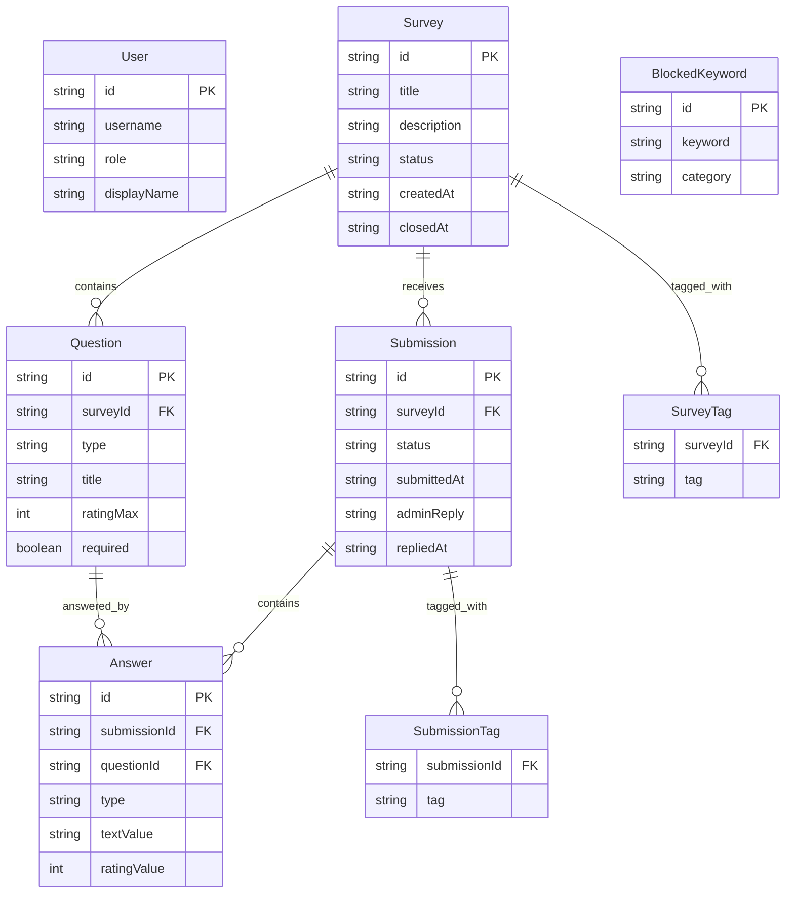

## 1. 架构设计



## 2. 技术说明

- 前端：React@18 + TailwindCSS@3 + Vite
- 初始化工具：Vite (npm create vite@latest)
- 后端：无后端，使用 Mock 数据模拟
- 数据库：无数据库，使用 localStorage 持久化 + 内存 Mock 数据
- 图表库：Recharts（趋势图、饼图）
- 路由：React Router v6
- 动画：Framer Motion

## 3. 路由定义

| 路由 | 用途 |
|------|------|
| /login | 登录页面 |
| /surveys | 调查管理页（管理员） / 可参与调查列表（员工） |
| /surveys/create | 创建新调查（管理员） |
| /surveys/:id | 填写调查 / 查看调查详情 |
| /square | 意见广场页 |
| /review | 内容审核页（管理员） |
| /reports | 统计报告页（管理员） |

## 4. API 定义（Mock）

### 4.1 用户相关

```typescript
interface User {
  id: string;
  username: string;
  role: "admin" | "employee";
  displayName: string;
}

// 登录
interface LoginRequest {
  username: string;
  password: string;
}
interface LoginResponse {
  user: User;
  token: string;
}
```

### 4.2 调查相关

```typescript
type QuestionType = "free_text" | "rating";

interface Question {
  id: string;
  type: QuestionType;
  title: string;
  description?: string;
  required: boolean;
  ratingMax?: number;
}

interface Survey {
  id: string;
  title: string;
  description: string;
  status: "draft" | "active" | "closed";
  createdAt: string;
  closedAt?: string;
  questions: Question[];
  responseCount: number;
  tags: string[];
}

// 创建调查
interface CreateSurveyRequest {
  title: string;
  description: string;
  questions: Omit<Question, "id">[];
  tags: string[];
}
```

### 4.3 意见提交相关

```typescript
interface Submission {
  id: string;
  surveyId: string;
  answers: Answer[];
  tags: string[];
  submittedAt: string;
  status: "visible" | "pending_review" | "rejected";
  adminReply?: string;
  repliedAt?: string;
  matchedKeywords?: string[];
}

interface Answer {
  questionId: string;
  type: QuestionType;
  textValue?: string;
  ratingValue?: number;
}

// 提交意见（匿名，不含用户信息）
interface SubmitFeedbackRequest {
  surveyId: string;
  answers: Answer[];
  tags: string[];
}
```

### 4.4 审核相关

```typescript
interface ReviewAction {
  submissionId: string;
  action: "approve" | "reject";
  reason?: string;
}
```

### 4.5 统计报告相关

```typescript
interface QuarterlyReport {
  quarter: string;
  totalSubmissions: number;
  reviewedSubmissions: number;
  rejectedSubmissions: number;
  categoryBreakdown: { tag: string; count: number }[];
  monthlyTrend: { month: string; count: number; byTag: Record<string, number> }[];
  topTags: { tag: string; count: number; percentage: number }[];
}
```

## 5. 数据模型

### 5.1 数据模型定义



### 5.2 关键词过滤规则

- 维护一个违规关键词列表（人身攻击、歧视性语言、暴力威胁等类别）
- 提交时对自由填写文本进行关键词匹配
- 命中任何关键词则提交状态设为 `pending_review`，记录命中的关键词
- 未命中则状态直接设为 `visible`

### 5.3 匿名性保障机制

- 提交数据结构中不包含任何用户标识字段
- Submission 与 User 之间无外键关联
- 管理员视图只展示提交内容和时间，无任何追溯入口
- 登录态仅用于权限控制，提交行为与用户身份在数据层完全解耦
